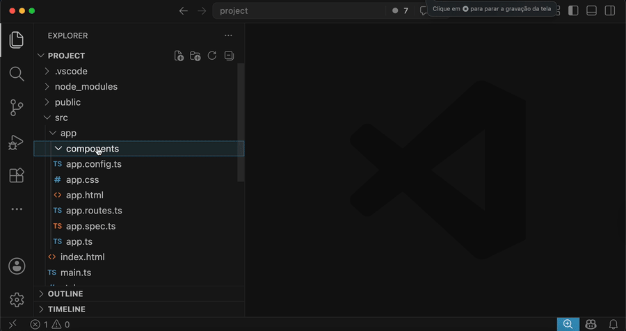

<div align="center">
  

  <h1>Angular Component Rename & Refactor</h1>

  <p><strong>Renomeie componentes Angular com segurança e prévia no VS Code.</strong></p>
  <p>Renomeie a pasta, os arquivos relacionados, a classe TypeScript, o selector, os templates e as referências do projeto a partir de um único comando.</p>

  [](https://marketplace.visualstudio.com/items?itemName=danilodevsilva.power-rename)
  [](https://marketplace.visualstudio.com/items?itemName=danilodevsilva.power-rename)
  [](https://marketplace.visualstudio.com/items?itemName=danilodevsilva.power-rename&ssr=false#review-details)
  [](LICENSE)

  [Instalar pelo Marketplace](https://marketplace.visualstudio.com/items?itemName=danilodevsilva.power-rename) · [English](README.md)

  <br />

  
</div>

---

## Refatoração Angular sem a caça às referências

Renomear um componente Angular normalmente envolve vários arquivos e diferentes tipos de referência. Esquecer uma classe, o uso de um selector ou um import lazy pode deixar a aplicação pela metade.

O **Angular Component Rename & Refactor** encontra as alterações relacionadas, mostra uma prévia e permite escolher o que será aplicado.

| Alvo | Antes | Depois |
|---|---|---|
| Pasta | `header/` | `loja/` |
| Componente | `header.component.ts` | `loja.component.ts` |
| Template e estilos | `header.component.html`, `header.component.scss` | `loja.component.html`, `loja.component.scss` |
| Teste | `header.component.spec.ts` | `loja.component.spec.ts` |
| Classe | `HeaderComponent` | `LojaComponent` |
| Selector | `app-header` | `app-loja` |
| Caminho de import | `./header/header.component` | `./loja/loja.component` |

## Por que usar

- **Prévia antes de editar** — revise os arquivos afetados e desmarque o que não deseja alterar.
- **Renomeação consciente de fronteiras** — altera tokens reais sem substituir cegamente toda substring parecida.
- **Filtro de referências** — só analisa arquivos externos que pareçam conectados por import, URL ou selector Angular.
- **Proteção contra conflito** — cancela a renomeação quando a pasta de destino já existe, sem sobrescrevê-la.
- **Local e privado** — funciona pela API de workspace do VS Code, sem serviço externo, conta, telemetria ou requisição de rede.

Por exemplo, renomear `header` atualiza `HeaderComponent`, `app-header`, `./header` e a classe exata `.header`. Nomes não relacionados como `subHeader`, `headers`, `header-icon` e `header-utils` são preservados de propósito.

## Como usar

1. No Explorer do VS Code, clique com o botão direito na pasta do componente Angular.
2. Selecione **Angular Rename: Renomear pasta e arquivos**.
3. Digite o novo nome do componente.
4. Escolha **Renomear** para aplicar o resumo ou **Ver detalhes** para revisar os itens individualmente.

Também é possível iniciar por um arquivo do componente com **Angular Rename: Renomear este componente**.

### Outras formas de executar

- **A partir de um arquivo:** clique com o botão direito em um arquivo cujo nome comece com o nome da pasta do componente.
- **Depois de renomear a pasta manualmente:** renomeie normalmente pelo Explorer; a extensão detecta e oferece atualizar arquivos e referências.
- **Pela Paleta de Comandos:** execute um dos comandos `Angular Rename`.

Instale pelo Quick Open do VS Code (`Ctrl+P` / `Cmd+P`):

```text
ext install danilodevsilva.power-rename
```

## Como funciona

```text
Analisa o componente e o workspace
              ↓
Calcula alterações com fronteiras seguras
              ↓
Mostra a prévia dos arquivos afetados
              ↓
Aplica somente os itens selecionados
```

A extensão trabalha com três grupos de alterações:

1. **Sistema de arquivos:** a pasta do componente e os arquivos filhos diretos que compartilham o nome-base.
2. **Conteúdo do componente:** classes, selectors, caminhos locais, templates e estilos dentro dos arquivos do componente.
3. **Referências do workspace:** arquivos suportados que importem o componente, referenciem um de seus recursos ou usem seu selector.

## Compatibilidade e requisitos

- VS Code **1.100.0** ou superior
- Componentes standalone e aplicações baseadas em NgModule
- Nomes clássicos do Angular CLI, como `header.component.ts`
- Nomes modernos sem sufixo, como `header.ts`, `header.html` e `header.spec.ts`
- Referências em TypeScript, JavaScript, HTML, CSS, SCSS, Sass e Less
- Não exige instalação do Angular CLI nem serviço externo

A pasta e seus arquivos filhos diretos devem compartilhar o mesmo nome-base:

```text
header/
├─ header.component.ts
├─ header.component.html
├─ header.component.scss
└─ header.component.spec.ts
```

## Configurações

Abra as configurações do VS Code e pesquise por **Angular Rename Files**.

| Configuração | Padrão | Descrição |
|---|---:|---|
| `smartRename.showPreview` | `true` | Mostra a prévia antes de aplicar as alterações. |
| `smartRename.updateImports` | `true` | Atualiza caminhos de import e referências suportadas no workspace. |
| `smartRename.updateFileContents` | `true` | Atualiza nomes e referências dentro dos arquivos do componente. |
| `smartRename.autoRenameOnFolderChange` | `true` | Detecta renomeações manuais de pasta e oferece atualizar os arquivos relacionados. |
| `smartRename.excludeFolders` | `node_modules`, `.git`, `dist`, … | Exclui pastas da busca por referências. |

A configuração `smartRename.filePatterns` aparece na versão atual, mas está reservada para uma futura melhoria do mecanismo. Hoje a seleção usa o nome-base compartilhado.

## Limitações conhecidas

- O mecanismo é baseado em convenções e texto; ele não utiliza o compilador Angular nem a AST do TypeScript.
- Aliases de caminho TypeScript, barrel exports e referências indiretas podem exigir conferência manual.
- Arquivos relacionados dentro de subpastas não são renomeados; os arquivos do componente devem ser filhos diretos da pasta selecionada.
- Em um arquivo que já referencia o componente, outro token solto com o mesmo nome também pode ser selecionado. Revise a prévia antes de aplicar.
- Variantes BEM como `.header-title` são preservadas para evitar confusão com componentes irmãos como `header-icon`.
- A operação é aplicada em fases. Dependendo do estado do editor, reverter toda a renomeação pode exigir mais de uma ação de Desfazer; recomenda-se usar o Controle de Código-Fonte antes de uma refatoração ampla.

## Suporte

Se algo não funcionar como esperado, [abra uma issue](https://github.com/daniloagostinho/smart-rename/issues) incluindo:

- versão do VS Code e sistema operacional
- estrutura do projeto Angular (standalone ou NgModule)
- nomes original e desejado para o componente
- exemplo mínimo de uma referência ignorada ou alterada incorretamente

Ideias de novas funcionalidades são bem-vindas no mesmo canal.

## Projeto

- [Histórico de versões](CHANGELOG.md)
- [Roadmap](ROADMAP.md)
- [Guia de contribuição](CONTRIBUTING.md)
- [Código de Conduta](CODE_OF_CONDUCT.md)
- [Licença MIT](LICENSE)

---

<sub>Extensão open source independente. Sem afiliação ou endosso do Google ou do time do Angular. Angular é marca de seu respectivo proprietário.</sub>
